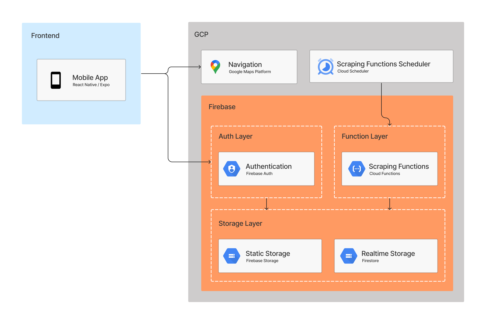

# Backend

## Motivation
For the Parcube application, we are using a micro-service architecture. Our frontend is using react-native/expo and the backend is using Firebase/GCP. We chose to following a micro-service architecture rather a typical MVC structure because it supports rapid and parallel development. For example, we are able to simultaneously work on the frontend expo application as well as the web scraper, and we can deploy those separately without having to think about whether they will interfere with each other. Although, the downside of this approach is that the system is more complicated than MVC, we are willing to make the tradeoff due to the advantages of micro-services architecture.

## System Architecture

## Firebase
### Firebase Auth
This service is used as our authentication platform. It will be responsible for handling email/password and 3rd party authentication (eg. Google, Facebook).

### Cloud Functions
This service is used host our web scraper functions. It will be responsible for scraping [Spot Hero](https://spothero.com/) for commercial space information. The scraper itself will be written using Typescript and rely on the framework [puppeteer](https://pptr.dev/) to extract information from the spot hero pages and store them in firestore.

### Firestore
Firestore is our main database which stores realtime data. The schema right now is the following:
- collection: locations
  - documents: cities (document id is the city name)
    - fields
      - geopoint: geopoint (long, lat)
    - collection: spots
      - documents: spot information (document id is auto-generated)
        - fields:
          - address: string
          - cost: number
          - num_spots: number
          - type: string (individual, commercial)
          - rating: number (0 - 5)
          - description: string
          - geopoint: geopoint (long, lat)
          - URL: URL to spot in third-party website (only for commercial type)

### Firebase Storage
This service is used to store static data. Examples are images of parking spaces, profile pictures, etc.

## Google Cloud Platform (GCP)

### Navigation
The navigation service is responsible for displaying hosts on the map, displaying users' current location, routing users to hosts' location and filtering hosts by distance.

### Scraping Functions Scheduler
This service will be used to automatically trigger the web scraper cloud function. You can think of it as a cloud cron job.
