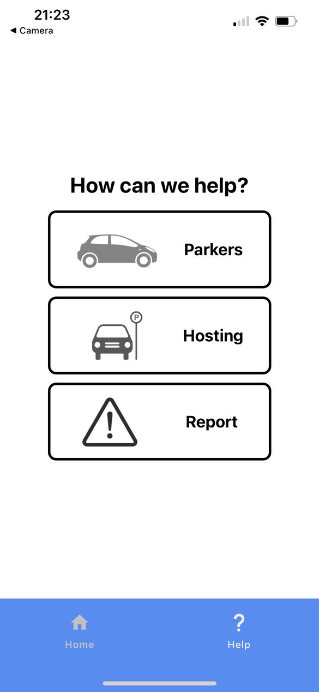
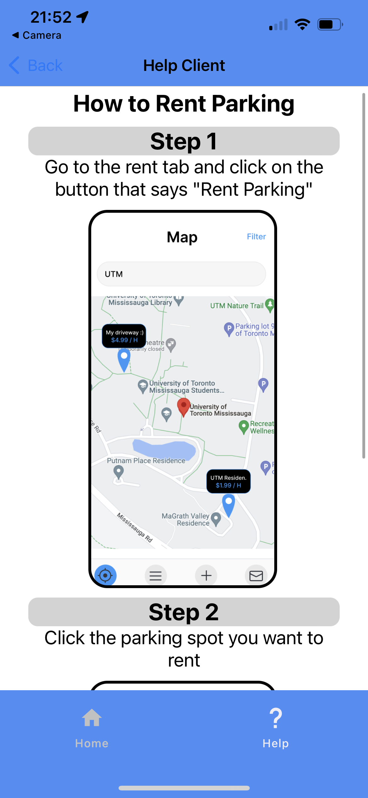

# Frontend

## assets/

Contains logos and images needed for the app

## app/

This folder contains the core of the Parcube Project application.

## app/pages/

This is where all of the source code for the app pages reside.

### Login Page:

Allows users to login to the application. It pops up as soon as the user launch the app for them to either sign up or sign in

### Home Page:

Contains the map that includes all the nearby parking locations, as well as a navigation tab at the bottom

### Rental Page:

Contains fields to select images, choose location, parking space information and booking information. This allows the user to lend their parking spot to drivers with the neccessary spot information.

### Help Page:

Contains information necessary for the user in case they need help using the application, or want to send a question to the developers.

## app/package.json

Defines our App information, scripts and the npm dependencies necessairy for the app.
Defines the modules that are enabled, in dependencies. (This also let's NPM know that these dependencies are local)
